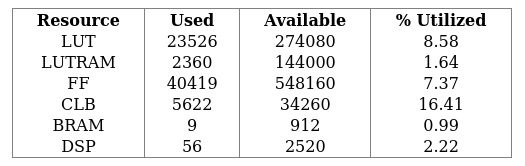
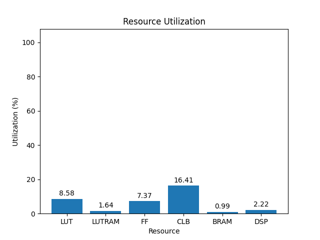

# 9eg

[Back](<../rev4.md>)

---

## 1.0
### fmcomms5

	

	

`/usr/bin/python ./scripts/gui.py ./utilization/carbon/rev4/fmcomms5/9eg/1.0/utilization-full.rpt`

## 3.0
### fmcomms5

	

	

`/usr/bin/python ./scripts/gui.py ./utilization/carbon/rev4/fmcomms5/9eg/3.0/utilization-full.rpt`

